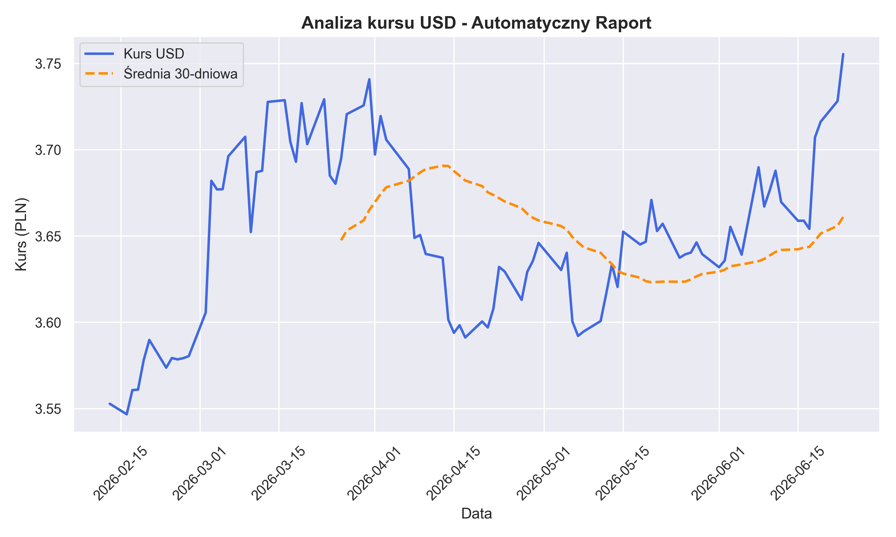
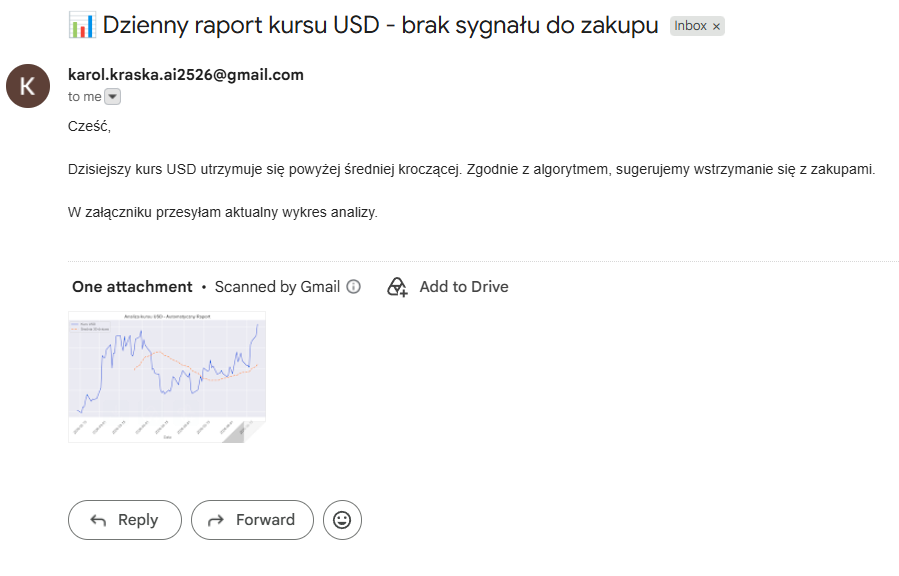

# Zautomatyzowany monitor kursów walut z alertami e-mail 📈

**Autor:** Karol Kraska

## 1. Cel projektu
Celem programu jest rozwiązanie realnego problemu analitycznego polegającego na śledzeniu trendów walutowych. Skrypt ma za zadanie wyłapywać momenty, w których waluta (np. USD) jest statystycznie tańsza niż jej średnia cena z ostatniego miesiąca, co stanowi potencjalny sygnał do zakupu.

## 2. Wykorzystane technologie
* **Pobieranie danych:** Biblioteka `requests` (połączenie z darmowym API Narodowego Banku Polskiego).
* **Przetwarzanie danych:** Biblioteka `pandas` (obliczanie 30-dniowej prostej średniej kroczącej SMA).
* **Wizualizacja:** Biblioteki `matplotlib` oraz `seaborn` do wygenerowania raportu analitycznego.
* **Komunikacja:** Moduły `smtplib` oraz `email.message` do automatycznej wysyłki powiadomień.

## 3. Architektura i Automatyzacja (Działanie w tle)
Skrypt został zaprojektowany do działania w trybie headless (bez interwencji użytkownika). Aby osiągnąć pełną automatyzację w systemie Windows, plik `monitor_walut.py` przystosowano do współpracy z narzędziem **Harmonogram zadań (Task Scheduler)**. 

Dzięki temu system operacyjny każdego dnia uruchamia skrypt w tle (np. po popołudniowej aktualizacji Tabeli A przez NBP). Program samodzielnie analizuje dane, generuje wykres i przesyła e-mail z gotowym raportem.

## 4. AI-Assisted Development 🤖
Projekt został zrealizowany pierwotnie w ramach zajęć uniwersyteckich ("Automatyzacja procesów przetwarzania danych"). W procesie pisania i optymalizacji kodu aktywnie wspierałem się asystentem AI (**Google Gemini**), traktując go jako "pair-programmera". Narzędzie to pomogło mi m.in. w szybszym sformatowaniu wykresów za pomocą biblioteki Seaborn oraz konfiguracji bezpiecznego połączenia SMTP.

---

## 📊 Dowody działania (Przykładowe wyjście programu)

**Wygenerowany wykres z analizą:**

**Automatyczny raport dostarczony na skrzynkę e-mail (działanie w tle):**

